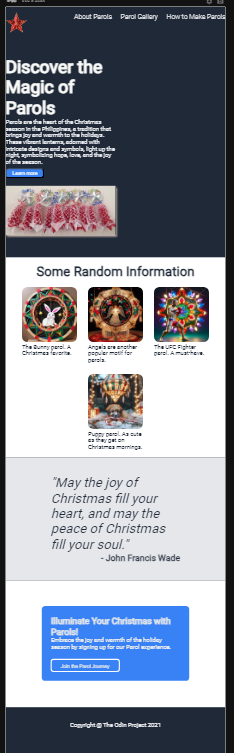
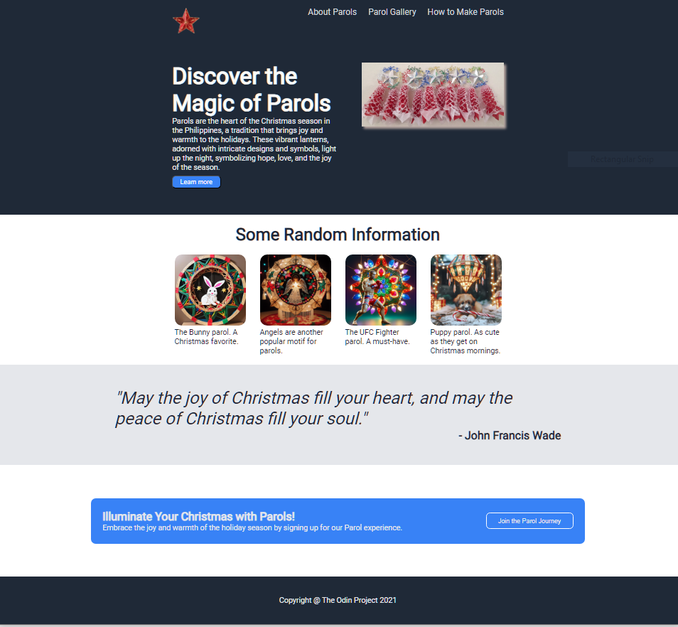

# Project: Landing Page (Frontend) - The Odin Project

## Project Overview
Welcome to the Landing Page Project, a part of "The Odin Project" curriculum. This project showcases the beauty and significance of Parols, traditional Filipino Christmas lanterns, through an engaging and informative landing page.

## Technologies Used
* **HTML:** For structuring the web pages.
* **CSS:** For styling the web pages.

## Installation
To run this project locally, follow these steps:

1. Clone the repository or download the source files.
2. Open `index.html` in your web browser..

## License
This project is licensed under the MIT License.

## Screenshots

### Project Specification 
[Project: Landing Page)](https://www.theodinproject.com/lessons/foundations-landing-page)
