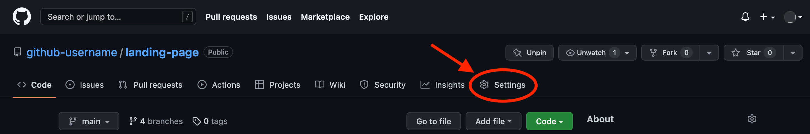

# Assignment
https://www.theodinproject.com/lessons/foundations-landing-page
Don’t forget to commit early & often! You can reference the Commit Message lesson here!

### Image One (Full Design)  
     

### Image Two (Color and Fonts)
   * The font that’s being used in the images is roboto.  
   

   NOTE: Hero text is the statement that appears at the top of a web page.

2. There are many ways to tackle a project like this, and it can be overwhelming to look at a blank HTML document and not know where to start. Our suggestion: take it one section at a time. The website you’re creating has 4 main sections (and a footer), so pick one and get it into pretty good shape before moving on. Starting at the top is always a solid plan.
3. For the section you’re working on, begin by getting all the content onto the page before beginning to style it. In other words, do the HTML and then do the CSS. You’ll probably have to go back to the HTML once you start styling, but bouncing back and forth from the beginning will take more time and may cause more frustration. (Note: you don’t need to use more than one stylesheet. Using only one CSS file is adequate for this project).
4. Many of the elements on this page are very similar to things you saw in our flexbox exercises… feel free to go back to those if you need a refresher.
5. Do not worry about making your project look nice on a mobile device. We’ll learn that later.
6. When you finish, don’t forget to push it up to GitHub!

## Viewing your project on the web
If you want to show your work (the project) to others, or submit a solution below, you will need to publish your site so that others can access it from the web, rather than just on your local machine. The good news is that if you have your project on GitHub (as described above), then doing this is straightforward.

GitHub allows you to publish web projects directly from a GitHub repository. Doing this will allow you to access your project from your-github-username.github.io/your-github-repo-name

There are a couple of ways to go about publishing your project, but the simplest is the following:

* Make sure that the main HTML file of your project is called index.html. If it is not, you need to rename it.
* Go to your GitHub repo on the web and click the Settings button as shown in the screenshot below.Screenshot pointing to the Settings located in an example repository

* Click on Pages on the left side bar.
* Change the Branch from none to main branch and click Save.
* It may take a few minutes (the GitHub website says up to 10), but your project should be accessible over the web from your-github-username.github.io/your-github-repo-name (obviously substituting your own details in the link).

Push your work to GitHub
Finally, let’s upload your work to the GitHub repository you created at the start of this tutorial.

Type git push. To be more specific, type git push origin main. Since you are not dealing with another branch (other than main) or a different remote (as mentioned above), you can leave it as git push to save a few keystrokes. NOTE: If at this point you receive a message that says